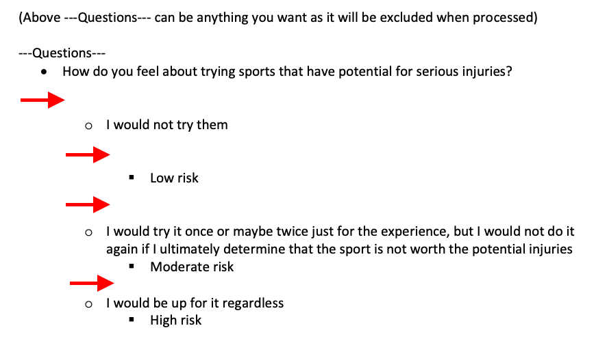

# PDF to Survey Converter
<a id="readme-top"></a>

<details>
  <summary>Table of Contents</summary>
  <ol>
    <li>
      <a href="#about">About</a>
      <ul>
        <li><a href="#built-with">Built With</a></li>
      </ul>
    </li>
    <li>
      <a href="#installation---getting-started">Installation - Getting Started</a>
    </li>
    <li>
      <a href="#usage">Usage</a>
    </li>
    <li>
      <a href="#guidelines---structuring-the-survey">Guidelines - Structuring the Survey</a>
    </li>
    <li>
      <a href="#info-on-key-files">Info on Key Files</a>
      <ul>
        <li><a href="#mainpy">main.py</a></li>
        <li><a href="#surveypy">survey.py</a></li>
        <li><a href="#test">test</a></li>
      </ul>
    </li>
    <li>
      <a href="#acknowledgments">Acknowledgments</a>
    </li>
  </ol>
</details>


## About
This project processes surveys that users create in a word processor (e.g. Word or Google Docs) and save as PDFs. The program parses the PDF into JSON format and allows users to take the survey interactively in the terminal. The program links certain answer choices to predefined traits (e.g. low risk, moderate risk, high risk) and tallies them based on the answer selected for each question. Responses are optionally saved in a CSV file, allowing results from multiple users to be collected in the same file.


While initially developed as a practice project in text processing, terminal interaction, and basic data tracking, there is room to expand. For example, in a healthcare context, it could be adapted to process screening surveys and map responses to risk levels or other metrics.

<p align="right">(<a href="#readme-top">back to top</a>)</p>


### Built With
- **Languages:** Python 3.8.5

<p align="right">(<a href="#readme-top">back to top</a>)</p>


<!-- GETTING STARTED -->
## Installation - Getting Started

To get a local copy up and running, follow these steps:

1. Clone the repo
   ```sh
   git clone https://github.com/dnce17/pdf_to_survey.git
   ```
2. Navigate into the project folder
   ```sh
   cd <project-folder>
   ```
3. Create a virtual environment (venv)
   ```sh
   python3 -m venv .venv
   ```
4. Activate venv
   ```sh
   source .venv/bin/activate
   ```
5. Install the required packages
   ```sh
   pip install -r requirements.txt
   ```

<p align="right">(<a href="#readme-top">back to top</a>)</p>


## Usage 
1. Create a survey with a word processor like Word or Google Doc by following the [template](README_assets/template.pdf)
    * Here are examples of properly formatted surveys:
        * [Risk Level Survey](test/test_files/properly_formatted_surveys/risk_level.pdf)
        * [FIghting Style Survey](test/test_files/properly_formatted_surveys/fighting_style.pdf)
    * You can try out these surveys by running one of the provided commands in the terminal
        ```sh
        python3 main.py test/test_files/properly_formatted_surveys/risk_level.pdf
        ```
        ```sh
        python3 main.py test/test_files/properly_formatted_surveys/fighting_style.pdf
        ```
2. Save the survey as PDF
3. To take the survey, ensure you're in the project folder and run the following command:
    ```sh
    python3 main.py path_to_PDF_file.pdf [results.csv]
    ```
    * Replace **path_to_PDF_file.pdf** with the path of your PDF survey
    * **Optionally**, replace **[results]** with any name. The results of the survey will be saved in this CSV file. If omitted, no CSV will be created or updated (if it already exists), and the results will not be saved anywhere.
        * **NOTE:** Users don't need to create the CSV file beforehand. It will be made if nonexistent.

        **Example**
        ```sh
        python3 main.py desktop/some_folder/personality_test.pdf personality_results.csv
        ```
4. The survey will now begin. Follow the prompts.
5. After completing the survey, if you provided the optional CSV file name, the file will appear in a folder called **csv_files** where results will be stored. If the file already exists, it will be updated. 

<p align="right">(<a href="#readme-top">back to top</a>)</p>


## Guidelines - Structuring the Survey
* Currently, the program only supports this bullet style:


* Regarding the [template](README_assets/template.pdf)
    * The **--Questions---** (case-insensitive) string identifies where the question section begins. Anything above this string will be ignored, so you can put anything there. 
    * Each answer choice can have **1 or more** traits associated with it and is **case-insensitive**
        * e.g. "lOw RiSK" is treated the same as "low risk" 
    * Having empty lines between questions, answer choices, and traits will still process correctly
    
    * Any unbulleted text between bullets that is not part of a question, answer choice, or trait will not cause errors, but will cause issues with how the survey is displayed
    
    * If a line starts with a lowercase `o` (due to text wrap or an intentional line break), prepend a `~` to it. The `~` will not appear when users take the survey.  
        * **Reason:** `o` may be interpreted as a sub-bullet. Adding `~` tells the program that this line is a continuation of the previous sentence.  
        
        * **NOTE:** You do **NOT** need `~` if the `o` is part of a word or is followed by punctuation
            * e.g: `"oo"`, `"oh"`, `"octopus"`, `"o,"`, `"o?"`


<p align="right">(<a href="#readme-top">back to top</a>)</p>


## Info on Key Files
### main.py
* Contains all the PDF and CSV file processing functions

#### main()
* Converts PDF survey into a JSON file called **questions.json**
* Allows users to verify traits to be tracked
* Runs the survey and displays results
* Optionally saves results to a CSV file

### survey.py
Contains all survey-related functions, which are imported to main.py

#### Survey class
* do_survey() is the primary function simulating the survey-taking process
    * Displays questions and answer choices
    * Validates user input
    * Uses the **Respondent** object to tally traits and display final results
* Includes helper methods (e.g. list all traits being tracked, get total count of each trait)

#### Respondent class
* Dynamically creates instance attributes for each trait using traits_to_track(), allowing them to be tallied
* Provides methods to tally traits and display results

### test
* Contains PDF files for edge-case and scenario testing
* Includes properly formatted sample surveys
* test_main.py verifies various core functionalities
  * Tests were ran using the following command:
    ```sh
    pytest test
    ```

<p align="right">(<a href="#readme-top">back to top</a>)</p>


## Acknowledgments
* Catching exceptions with a Python `with` statement – [StackOverflow](https://stackoverflow.com/questions/713794/catching-an-exception-while-using-a-python-with-statement)
* Testing `SystemExit` with `pytest` – [Reddit CS50 discussion](https://www.reddit.com/r/cs50/comments/zvr2m3/testing_sysexit_with_pytest/)
* Issue on pdfplumber parsing – [GitHub](https://github.com/jsvine/pdfplumber/issues/334)
* Handling non-ASCII characters in Python – [StackOverflow](https://stackoverflow.com/questions/21639275/python-syntaxerror-non-ascii-character-xe2-in-file)
* Installing packages and virtual environments – [Python Packaging Guide](https://packaging.python.org/en/latest/guides/installing-using-pip-and-virtual-environments/)

<p align="right">(<a href="#readme-top">back to top</a>)</p>
