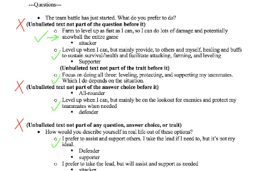
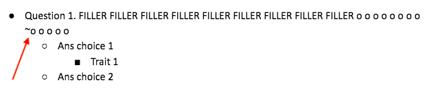

# PDF to Survey/Quiz Converter
<b>Note</b>: For simplicity, "quiz" will refer to both surveys and quizzes throughout this document

## Project Inspiration
This project idea came about after I finished the [battle style quiz](https://github.com/dnce17/battle_style_quiz) project, which lets users take a quiz to determine their battle style (attacker, defender, supporter, all-rounder). While the code in that quiz can be configured to make a personalized quiz, I realized it would be more user-friendly if users could simply just upload a PDF file of a quiz they made in a text processor for others to take.

Typing a quiz in a text processor appears more efficient too because the focus is solely on writing the quiz rather than touching code and possibly causing errors from, say, accidently deleting a bracket.

## Function
This program allows users to process personalized quizzes made in text processors for anyone to take in the terminal. These quizzes are converted from PDF and all answer choices are associated with specific traits (e.g. risk levels, personality type) that are tallied accordingly as users select their answer for each question. Upon completion, users receive results based on their responses. Alongside their name, results can optionally be stored into a CSV file with others who have taken the same quiz. 

### How to run/test
To run, type and enter the following in terminal
1. source .venv/bin/activate
    * activates the virtual env
2. python3 -m pip install -r requirements.txt OR pip3 install -r requirements.txt
    * installs the packages needed to run the program
3. python3 main.py path_to_PDF_file.pdf [OPTIONAL_csv_file_to_save_to].csv
    * If CSV file is excluded, users take the quiz and get their results. Otherwise, users also provide their name and store their results in the CSV file.
        * Users don't need to create the CSV file beforehand. It will be made if nonexistent.

* To test --> <b>pytest test</b>
    * If configurations are made to this program, run this to see if certain functions still work properly

### Technologies Used
* Python 3.8.5
    * <b>IMPORTANT</b>: Python 3.8 is minimally required since features from this version are used
* JSON
* Text processors tested (were used to make quizzes, saved as PDF, and processed)
    * Microsoft Word
    * Google Docs

### Guidelines To Ensure PDF File Processes Correctly
* Currently, the program only supports the use of the following bullet style:

* Add ---Questions--- <b>(case-insensitive)</b> right before the questions begins 
    * this helps the program know where questions begin
    * Above ---Questions--- can be anything. It will be ignored when processed
* Each answer choice can have <b>1 or more</b> traits associated with it and is case-insensitive 
    * e.g. "lOw RiSK" is treated the same as "low risk"
* Having none or any empty lines between questions, answer choices, and/or traits will still process fine

#### CAUTION
* Having any unbulleted characters between bullets and/or sub-bullets that are not intended to be part of a question, answer choice, and/or trait before it will not raise errors, but text display issues with the quiz

* If there's a line starting with lowercase o by itself (example below) regardless from text wrap or intentional line break, put a ~ before it. The ~ will not appear when users take the quiz. 
    * Reason: o is sometimes treated as a sub-bullet, so ~ lets the program know that the line beginning with o is part of the sentence before it.
    * You do <b>NOT</b> need ~ if o is part of a larger word or has punctuation 
        * e.g. "oo", "oh", "octopus", "o,", "o?" does not count

* Click the links below to see a template and some examples
    * [Template](README_assets/template.pdf)
    * [Risk Level Quiz](test/test_files/proper_format_quizzes/risk_level.pdf)
    * [Battle Style Quiz](test/test_files/proper_format_quizzes/battle_style.pdf)

### Info on Key Files
* main.py
    * main function runs all necessary functions to 
        1. convert PDF quiz into JSON format
        2. allow users to check if the traits to tally are correct
        3. allow users to take quiz and get results
        4. optionally save results in a CSV file
    * contains all PDF and CSV file processing functions:
        * opening PDF file, extracting + filtering its text, and compiling it into a JSON file
        * creation of CSV file and storing results
* quiz.py
    * contains all quiz-related functions imported to main
    * Quiz class
        * do_quiz() is the primary function stimulating the quiz-taking process. It shows questions, answer choices, and validates the choice selected. Afterwards, it uses a Quizzee class object to tally the trait(s) associated with that choice and show results once quiz is done
        * contains other functions that can be called (e.g. show all traits being tallied in the quiz, count the max possible total of each trait)
    * Quizzee class
        * traits_to_track() dynamically creates properties of all traits in a certain quiz, allowing them to be tallied
        * has functions that show results and tally the traits, which are used in the Quiz class's do_quiz()
* test
    * has various PDF files that test certain situations and edge cases
    * has few properly formatted quizzes to ensure program works with various quizzes 
    * has test_main.py to ensure functionality of various functions
* requirements.txt
    * contains packages/libraries that this program requires to operate

### Credits
1) https://stackoverflow.com/questions/713794/catching-an-exception-while-using-a-python-with-statement
2) https://www.reddit.com/r/cs50/comments/zvr2m3/testing_sysexit_with_pytest/
3) https://github.com/jsvine/pdfplumber/issues/334
4) https://stackoverflow.com/questions/21639275/python-syntaxerror-non-ascii-character-xe2-in-file
5) https://packaging.python.org/en/latest/guides/installing-using-pip-and-virtual-environments/
6) https://stackoverflow.com/questions/7225900/how-can-i-install-packages-using-pip-according-to-the-requirements-txt-file-from
